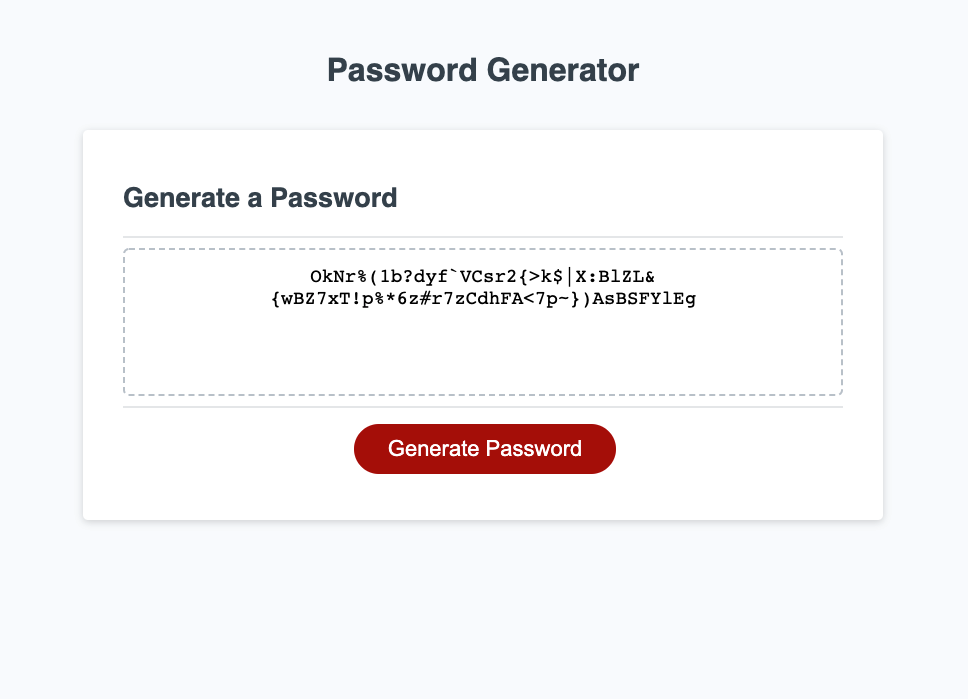

# Module 3 Challenge - Christian Kaikai

## Acceptance Criteria Checklist

- When button is clicked, it generates a series of prompts 
- It prompts for the length of the password
- It prompts to include lowercase characters
- It prompts to include uppercase characters
- It prompts to include numeric characters
- It prompts to include special characters
- It makes sure atleast one character is picked
- Generates random password and adds it to the DOM

[View depolyed project here](https://ckaikai19.github.io/purple/)

---

## Mockup

---
